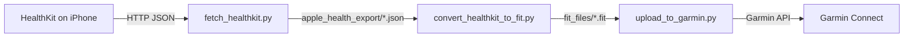

# Apple Health to Garmin

Convert Apple Watch workouts to Garmin's FIT format with full-resolution heart rate, running power, stride length, vertical oscillation, and ground contact time.

Apple's "Export All Health Data" aggregates workout heart rate into low-resolution chunks. This tool bypasses that by reading HealthKit directly on the iPhone via a small sideloaded app, then converting the full-resolution data to FIT files for Garmin Connect.

## How it works



1. **iOS app** serves workout data from HealthKit over a local HTTP server
2. **Fetch script** pulls all workouts (metrics + GPS) from the phone to your Mac
3. **Converter** produces FIT files with linearly interpolated metrics
4. **Upload script** pushes FIT files to Garmin Connect via the API

## Requirements

- iPhone with Apple Health data
- Mac with [Xcode](https://apps.apple.com/app/xcode/id497799835) (for sideloading the iOS app)
- [uv](https://docs.astral.sh/uv/) (Python package manager)

## Quick start

```bash
git clone https://github.com/brtkwr/apple-health-export.git
cd apple-health-export
```

### 1. Install the iOS app

1. Open `HealthExport.xcodeproj` in Xcode
2. Set your development team in **Signing & Capabilities**
3. Connect your iPhone via USB and hit **Run**
4. On your iPhone: **Settings > General > VPN & Device Management** → trust the developer certificate

### 2. Fetch workouts from the phone

Open the app on your iPhone, tap **Start**, then from your Mac:

```bash
python3 scripts/fetch_healthkit.py <iphone-ip>
```

This pulls all Apple Watch workouts with full-resolution metrics and GPS routes into `apple_health_export/`. Keep the phone screen on while fetching — HealthKit data is inaccessible when the screen is locked.

### 3. Convert to FIT

```bash
uv run scripts/convert_healthkit_to_fit.py apple_health_export
```

FIT files are written to `fit_files/`, organised by year and month.

Filter by activity type:

```bash
uv run scripts/convert_healthkit_to_fit.py apple_health_export --activity running
```

### 4. Upload to Garmin Connect

```bash
# First time: log in and save tokens
uv run scripts/login_garmin.py

# Upload all FIT files
uv run scripts/upload_to_garmin.py fit_files
```

Set `GARMIN_EMAIL` and `GARMIN_PASSWORD` as environment variables. MFA is supported — you'll be prompted for the code on first login. Tokens are saved to `~/.garmin_tokens/` for subsequent runs.

Use `--dry-run` to preview without uploading:

```bash
uv run scripts/upload_to_garmin.py fit_files --dry-run
```

Or import manually: go to [Garmin Connect](https://connect.garmin.com), click **"+"** → Import Data, and upload your FIT files.

## What gets exported

| Data                 | Included |
| -------------------- | -------- |
| GPS coordinates      | Yes      |
| Heart rate           | Yes      |
| Distance             | Yes      |
| Calories             | Yes      |
| Altitude             | Yes      |
| Running power        | Yes      |
| Stride length        | Yes      |
| Vertical oscillation | Yes      |
| Ground contact time  | Yes      |
| Running speed        | Yes      |

## Why not use Apple's XML export?

Apple's "Export All Health Data" stores workout heart rate as aggregated records spanning ~15 minute windows. A 65-minute run might only have 23 HR data points in the export. The same workout viewed on Strava (which reads HealthKit directly) shows 513 data points.

This is a [known limitation](https://discussions.apple.com/thread/253843222) of Apple's XML export. The full-resolution data exists on the phone via `HKQuantitySeriesSampleQuery` — this tool accesses it.

## API endpoints

The iOS app serves JSON on port 8080:

| Endpoint               | Description                           |
| ---------------------- | ------------------------------------- |
| `GET /workouts`        | List all workouts with metadata       |
| `GET /workouts/{index}` | All metrics + GPS route for a workout |

## Development

### Mock server

For local development and testing without a phone:

```bash
python3 scripts/mock_server.py
```

Serves sample workouts on `http://localhost:8080` with the same API as the iOS app.

### Tests

```bash
uv run pytest tests/ -v
```

### CI

Tests run on GitHub Actions for Python 3.11–3.14. Coverage is reported on PRs. iOS build can be triggered manually via workflow dispatch.

## License

MIT
